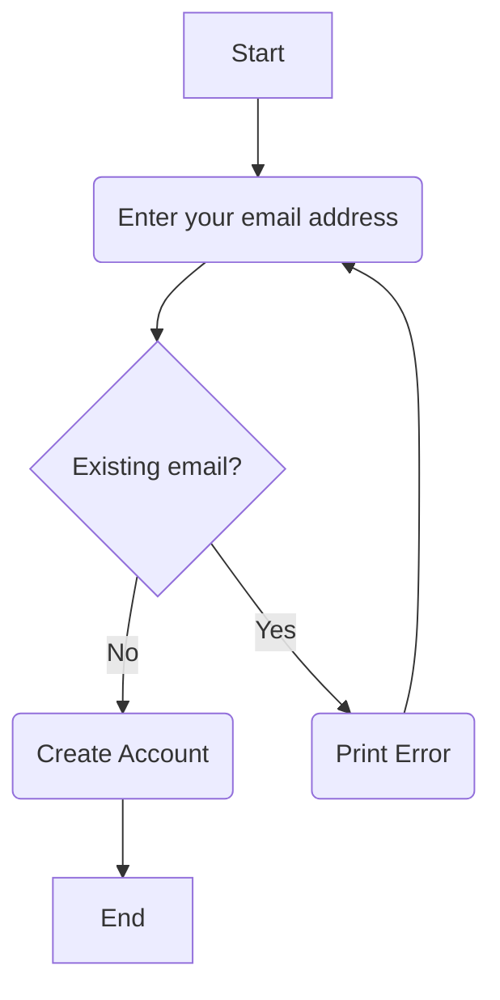
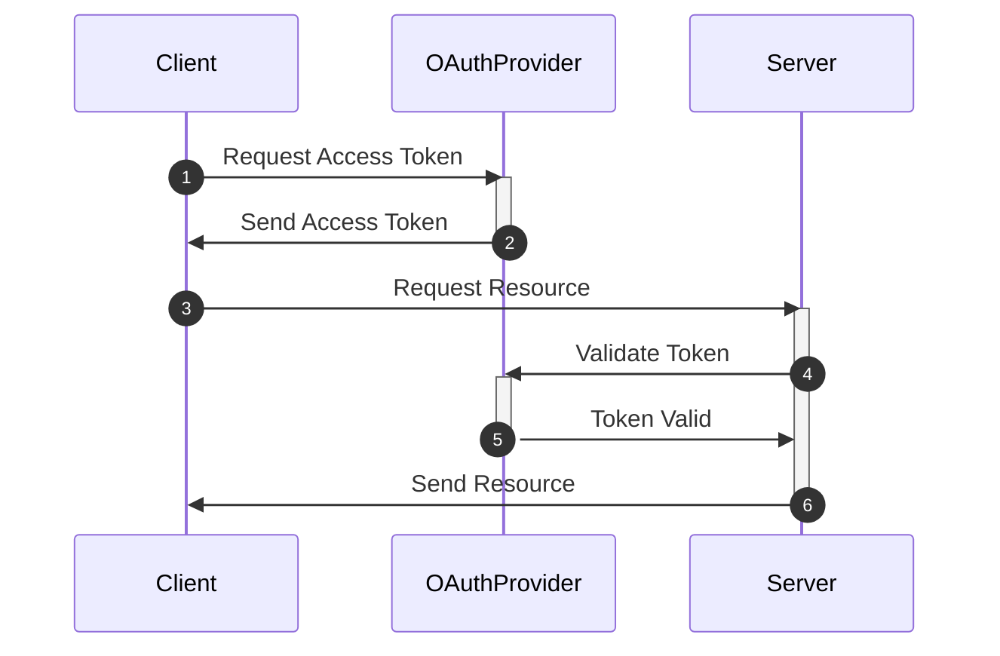

# Mermaid tutorial

Let's go

## Flow Diagram
---

```mermaid
flowchart
    S[Start] --> A;
    A(Enter your email address) --> B{Existing email?};
    B -->|No| C(Create Account);
    B -->|Yes| D(Print Error);
    D --> A;
    C --> E[End]
```

## Sequence Diagram
---

```mermaid
sequenceDiagram
    autonumber
    participant Client
    participant OAuthProvider
    participant Server
    Client->>OAuthProvider: Request Access Token
    activate OAuthProvider
    OAuthProvider->>Client: Send Access Token
    deactivate OAuthProvider
    Client->>Server: Request Resource
    activate Server
    Server->>OAuthProvider: Validate Token
    activate OAuthProvider
    OAuthProvider->>Server: Token Valid
    deactivate OAuthProvider
    Server->>Client: Send Resource
    deactivate Server
```